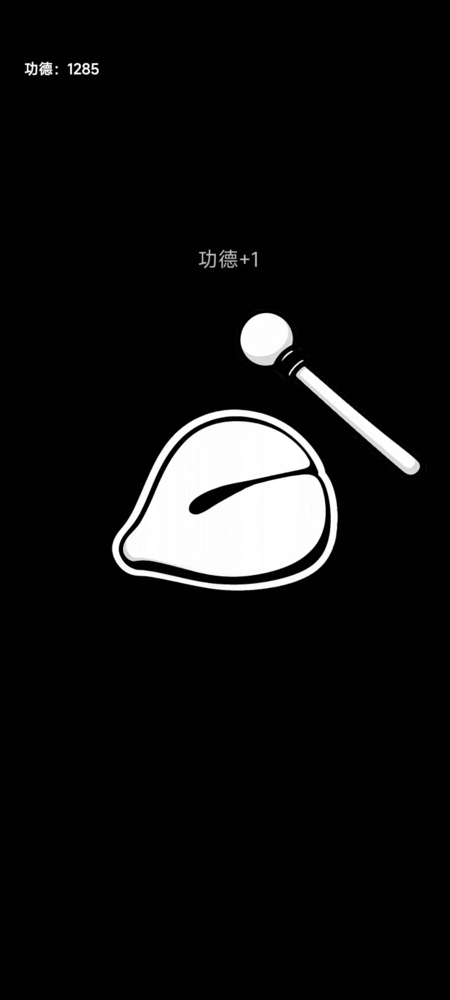

# 🪵 电子木鱼

> 一个用 **Cocos** 开发的电子木鱼小游戏。
> 敲一敲木鱼，积一点功德。🙏

本项目是一个简单的 Android 电子木鱼小游戏，还原了当年比较流行的「敲电子木鱼」玩法。

项目以学习、练手和记录开发过程为目的进行开源，欢迎大家 Star ⭐、Fork 🍴，也欢迎提交 Issue 或 Pull Request。

---

## 📱 项目预览

### 游戏截图

<p align="center">
  
  
</p>


> 

---

## ✨ 功能

目前项目实现了比较基础的电子木鱼玩法：

* 🪵 点击木鱼进行敲击
* 🙏 每次敲击增加功德
* 🔊 木鱼敲击音效
* ✨ 敲击动画效果
* 📱 Android 手机适配
* 🎮 简单的游戏交互与 UI
* 💾 基础数据记录

项目目前以轻量小游戏为主，没有加入复杂的游戏系统。

---

## 🛠️ 技术栈

| 技术                      | 用途     |
| ----------------------- | ------ |
| Cocos                   | 游戏开发引擎 |
| JavaScript / TypeScript | 游戏逻辑开发 |
| Android                 | 游戏运行平台 |

---

## 📦 安装

目前仅提供 **Android APK** 版本。

可以在 GitHub Releases 中下载最新 APK，或者直接下载项目中提供的 APK 文件。

### Android 安装

1. 下载 `.apk` 文件
2. 将 APK 传输至 Android 手机
3. 点击安装
4. 打开游戏即可

> 部分 Android 手机首次安装非应用商店 APK 时，可能需要允许「安装未知来源应用」。

---

## 🚀 本地运行

如果你想自己研究或者继续开发，可以直接克隆本项目。

```bash
git clone https://github.com/Shimiankang/WoodenFish.git
```

然后使用对应版本的 **Cocos** 打开项目。

打开项目后即可查看完整源码，并进行调试、修改和重新构建。

---

## 📂 项目结构

项目主要结构如下：

```text
WoodenFish/
├── assets/                # 游戏资源
├── build/                 # 构建相关文件
├── native/                # 原生平台相关内容（如有）
├── settings/              # 项目配置
├── package.json           # 项目配置
├── README.md              # 项目说明
└── ...
```

> 实际目录结构可能会随着 Cocos 项目版本及后续开发有所变化。

---

## 🎮 游戏玩法

游戏玩法非常简单：

**点击木鱼 → 敲击 → 获得功德。**

没有复杂的任务系统，也没有复杂的数值养成，主打一个：

> **功德 +1
> 功德 +1
> 功德 +1
> ……**

🙏
一键清心，敲出功德。

---

## 📸 项目展示

可以在这里放一些游戏实际运行截图或录屏：

```text
首页
↓
电子木鱼
↓
点击木鱼
↓
功德增加
↓
敲个不停
```

---

## 💡 开源目的

这个项目主要用于：

* 学习 Cocos 游戏开发
* 熟悉 Android 游戏构建流程
* 练习游戏 UI 与交互
* 记录个人开发过程
* 分享一个简单有趣的小项目

项目本身比较简单，更多的是作为一个个人练手作品进行开源。

---

## 🔮 后续计划

后续可能会考虑加入一些有趣的小功能，例如：

* [ ] 功德排行榜
* [ ] 更多木鱼皮肤
* [ ] 更多敲击音效
* [ ] 功德暴击效果
* [ ] 功德统计
* [ ] 夜间模式
* [ ] 更多趣味彩蛋
* [ ] iOS 版本
* [ ] Web 版本

> 功德系统什么时候上线，主要取决于开发者最近有没有功德。🙏

---

## 📄 开源协议

本项目采用 **MIT License** 开源。

你可以自由使用、修改和学习本项目，但请遵守项目 LICENSE 中的相关规定。

---

## ⭐ Star

如果这个项目对你有帮助，或者你觉得这个项目挺有意思：

**欢迎点一个 Star ⭐**

你的 Star 就是我继续敲木鱼的动力。

---

## 🙏 最后

忙里偷闲，敲一下木鱼。

**功德 +1。**

🪵

---

<p align="center">
  Made with ❤️ & Cocos
</p>
